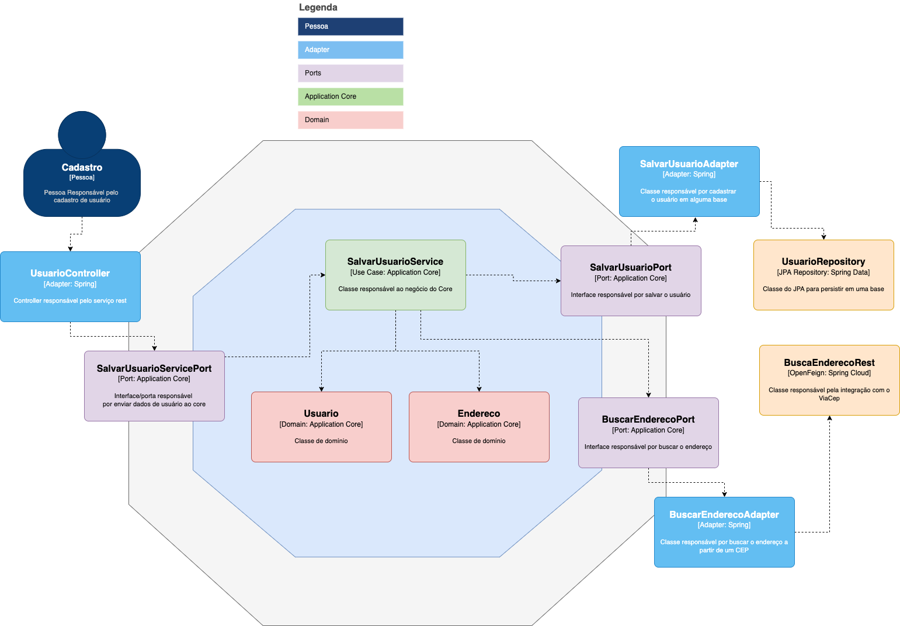

# Exemplo de arquitetura Hexagonal feita em Spring

Esse projeto foi feito para explicar melhor sobre a arquitetura Hexagonal, podendo ter sido feito com qualquer outra linguagem ou framework.

## Para rodar a app na sua máquina

Execute esse comando em sua IDE ou linha de comando preferida:
```shell script
mvn spring-boot:run
```
Veja a imagem de como está feita essa arquitetura em uma visão de componentes do C4 model



Também fiz um exemplo igual em Quarkus.
Veja o repo abaixo:
https://github.com/natanielpaiva/arquitetura-hexagonal